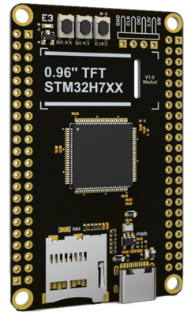

# Mbed OS 6 port for WeAct STM32H743VIT6

[WeAct STM32H743VIT6](https://github.com/WeActTC/MiniSTM32H7xx) is small board with
powerful [STM32H743VI](https://www.st.com/en/microcontrollers-microprocessors/stm32h743vi.html) MCU. This repository
provides Mbed OS 6 support for this board.

## Board description

### Microcontroller features

* STM32H743VI in LQFP100 package
* ARM®32-bit Cortex®-M7 core with double-precision FPU
* 480 MHz max CPU frequency
* VDD from 1.62 V to 3.6 V
* 2 MB Flash
* 1 MB RAM (but only 512 KB can be used transparently. To use all memory a linker script should be adjusted)
* GPIO with external interrupt capability
* 16-bit ADC (3)
* 12-bit DAC (1)
* RTC
* Timers (22)
* I2C (4)
* USART (9)
* SPI (5)
* QSPI (1)
* SDMMC (2)
* USB 2.0 full-speed (2)
* Ethernet MAC interface (1)

### Board features

* Small foot-print
* Flexible board power supply: USB VBUS or external source (3.3V, 5V)
* User LED: LED1
* Programming/Debug port
* Type-C USB connector
* High speed external quartz oscillator 25 MHz
* Low speed external quartz oscillator 32,768 KHz
* 8 MB SPI Flash
* 8 MB QSPI Flash
* Optional ST7735 TFT display
* Digital camera connector

### Default pins

| description | pin | note |
|---|---|---|
| STDIO_UART_TX | PA_2 | |
| STDIO_UART_RX | PA_3 | |
| led pin (LED1 alias) | PC_13 | |
| user button pin (BUTTON1 alias) | PC_13 | `PullDown` mode should be used |

### Mbed OS version support

| Mbed OS | status |
|---|---|
| 6.12 | Compiles and runs ok |

## Project configuration

After base mbed project creation and configuration perform the following configuration to setup board:

1. Go to project root directory.
2. Run `mbed add https://github.com/vznncv/TARGET_WEACT_H743VI.git` to add this library to your project.
3. Copy `custom_target.json` from library folder to your project folder.
4. Run `mbed target WEACT_H743VI` command to set default board.
5. Run `mbed toolchain GCC_ARM` to set default toolchain.
6. Run `mbed export ...` command if you use IDE, as new files have been added to you project.

To program/debug you project, connect hardware debugger and optionally usb to serial adapter to pins PA_3, PA_2.

note: a serial adapter is requires only for `printf`/`scanf` functionality and tools that use it
(like *greentea* tests).

### Examples

Base examples can be found in the `examples` folder.

## License

Unless specifically indicated otherwise in a file, files are licensed under the MIT license.
